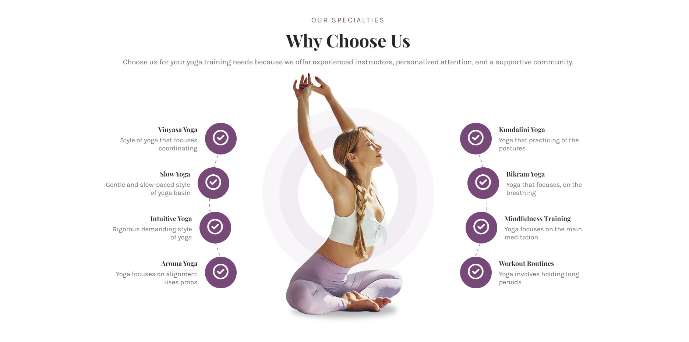
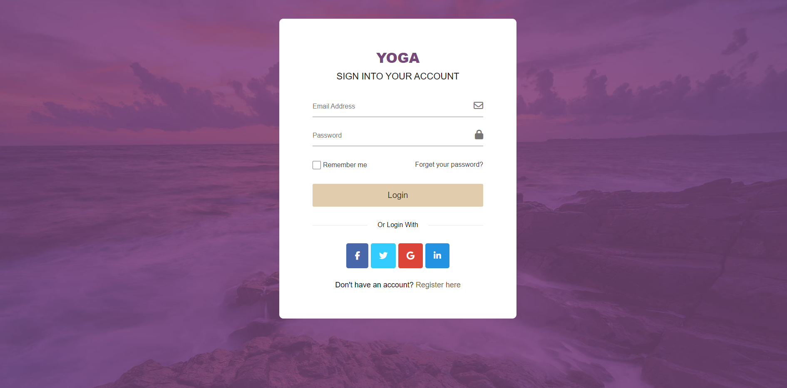
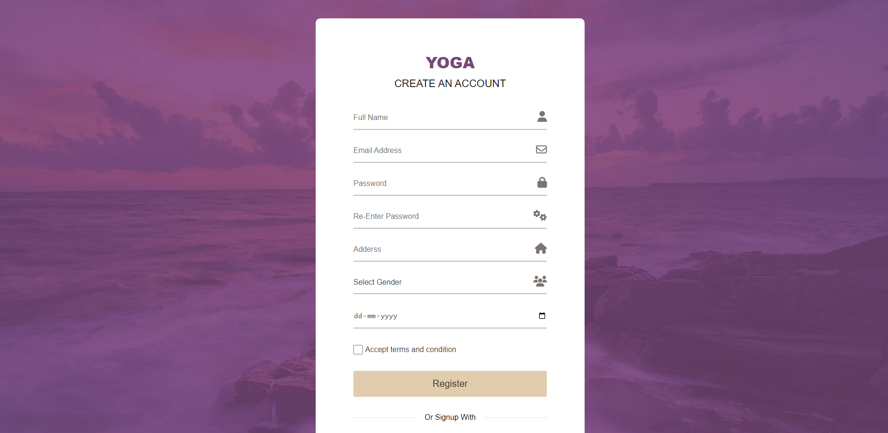

# URL Shortener

## About the Project

This project is a Yoga center platform featuring a fully responsive front end built with React.js, and a back end built with Node.js and Express.js. JSON Web Token is implemented for the login and signup features. The application's front end provides an intuitive user interface, while the back end server manages all the logic and database interactions.
### Deployed Frontend Link
-[Vercel Deployement] (https://yoga-flow.vercel.app/)
### Repository Links
- [Frontend Repository](https://github.com/prashantuchariya1/YogaFlow)
- [Backend Repository](https://github.com/prashantuchariya1/YogaFlow-Backend.git)

### Built With

- [React.js](https://reactjs.org/)
- [Node.js](https://nodejs.org/)
- [Express](https://expressjs.com/)
- [MongoDB](https://www.mongodb.com/)

## Images

### Prerequisites

Ensure you have the following installed:
- Node.js
- npm
- MongoDB

### Contact
Email - prashantuchariya1@gmail.com
